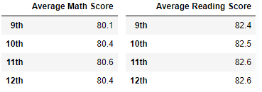
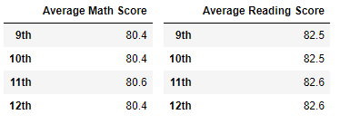
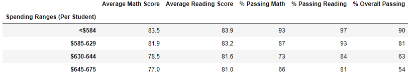
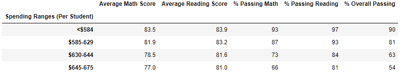
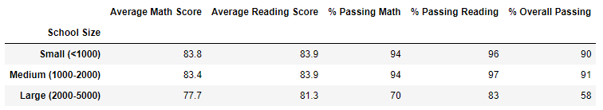
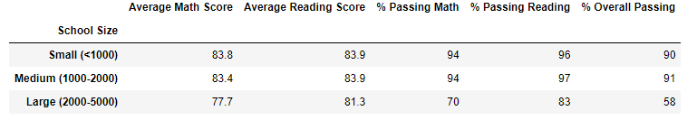
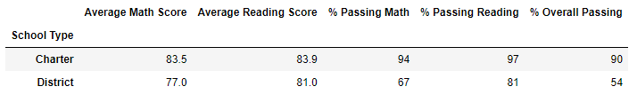
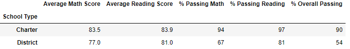

# School_District_Analysis
## Project Overview
Maria, The Chief Data Scientist for the local School Board had requested that an analysis be conducted on the standardized testing results of multiple schools in the district. The purpose of this analysis was for presentation to the School Board to assist them with insights into performance trends and patterns. 

The analysis consisted of the following:
- A district level summary
- A school level summary
- A lit of the top 5 performing schools
- A list of the bottom 5 performing schools
- Grade level averages for math scores by school
- Grade level averages for reading scores by school
- Test scores by school spending per student
- Test scores by school size
- Test scores by school type
     
However, a question of academic dishonesty involving the test scores of the 9th grade class at Thomas High School requires that a new analysis be performed. The new analysis will disregard the test scores for the class in question. The results of this new analysis are to be compared to the original results to determine the impact of removing the testing scores for the class.

## Results

- **Impact on district summary**
     - At the district summary level the following results were reduced:
          - the average math score was reduced by 0.1 to 78.9 
          - the percentage passing math was reduced by 0.2% to 74.8% 
          - the percentage passing reading was reduced by 0.1% to 85.7%
          - the percentage passing overall was reduced by 0.3% to 64.9%

*New School District Summary*
     

*Original School District Summary*
     

- **Impact on school summary**
     - At the school summary level for Thomas High School the follow results were changed:
          - the average reading score increased by 0.1 to 83.9
          - the percentage passing math was reduced by 0.1% to 93.2% 
          - the percentage passing reading was reduced by 0.3% to 97.0%
          - the percentage passing overall was reduced by 0.3% to 90.6% 

*New School Summary*

*Original School Summary*

- **Impact on Thomas High School's performance relative to other schools**
     - Thomas High school went from being the second highest school by overall passing percentage to only being tied for second place with 2 other schools due to their 0.3% reduction in this metric.

*New Top 5 Schools*

*Original Top 5 Schools*

- **Impact on analysis of math and reading scores by grade level**
     - At the scores by grade level the following results were changed:
          - the average math score for the 9th grade was reduced by 0.3 to 80.1
          - the average reading score for the 9th grade was reduced by 0.1 to 82.4

*New Average Scores by Grade*

*Original Average Scores by Grade*

- **Impact on analysis of scores by school spending per student**
     - There was no change in the results of the analysis on scores based on school spending per capita.
     
*New Scores By School Spending per Capita*

*Original Scores by School Spending Per Capita*

- **Impact of analysis of scores by school size**
     - There was no change in the results of the analysis on scores based on school size.

*New Scores By School Size*

*Original Scores by School Size*

- **Impact of analysis of scores by school type**
     - There was no change in the results of the analysis on scores based on school size.

*New Scores By School Type*

*Original Scores by School Type*

## Summary

In summary the overall impact of the removal of the Thomas High School 9th Grade test scores was minimal across all aspects of the analysis. 

- There was a negligible (0.3% or less) impact to both the average scores and the percentage passing in the district wide summary. 
- There was a negligible (0.3% or less) impact to both the average scores and the percentage passing in the school summary for Thomas High School. 
- Thomas High School remained second overall for passing percentage, however it was now tied at that level with two other schools. 
- There was a negligible (0.3% or less) reduction in the average scores at the 9th grade level. 
- There was no impact on the results of the analyses based on per capita spending, school size, or school type.

Therefore it is my recommendation that the school board proceed with using the new analysis that excludes questionable grades as it is a more accurate reflection of performance and will be of more use for their planning purposes. 
