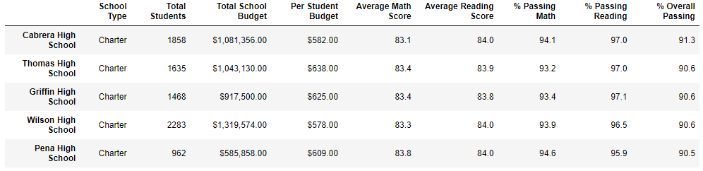

# School_District_Analysis
## Project Overview
Maria, The Chief Data Scientist for the local School Board had requested that an analysis be conducted on the standardized testing results of multiple schools in the district. The purpose of this analisys was for presentation to the School Board to assist them with insights into performance trends and patterns. 

The analysis consisted of the following:
- A district level summary
- A school level summary
- A lit of the top 5 performing schools
- A list of the bottom 5 perfroming schools
- Grade level averages for math scores by school
- Grade level averages for reading scores by school
- Test scores by school speing per student
- Test scores by school size
- Test scores by school type
     
However, a question of academic dishonesty involving the test scores of the 9th grade class at Thomas High School requires that a new anlaysis be performed. The new analysis will disregard the test scores for the class in question. The results of this new analysis are to be compared to the original results to determine the impact of removing the testing scores for the class.

## Results

- Impact on district summary
     - There was a negligible (0.3% or less) impact to both the average scores and the percentage passing in the district wide summary.

*New School District Summary*

*Original School District Summary*

- Impact on school summary
     - There was again a negligible (0.3% or less) impact to both the average scores and the percentage passing in the school summary for Thomas High School.

*New School Summary*

*Original School Summary*

- Impact on Thomas High School's performance relative to other schools
     - Thomas High school remained the second highest perfroming school in the district after only their overall passing percentage decrease by 0.3%

*New Top 5 Schools*

*Original Top 5 Schools*

- Impact on analysis of math and reading scores by grade level

- Impact on analysis of scores by school spending per student

- Impact of analysis of scores by school size

- Impact of analysis of scores by school type

## Summary
